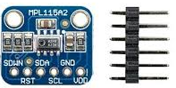
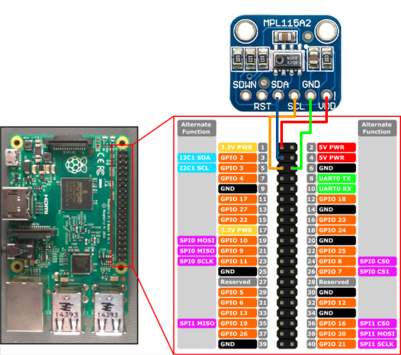

# MPL115A2
You can find my code to acquire data from a MPL115A2 I2C Barometer with a rpi 3 model B.



## Installation
Before using this code run these commands lines to download and install smbus library on your Raspberry pi.
- Download:   *(By default: user: pi, password: raspberry)*
  ```cpp 
  sudo apt-get install build-essential libi2c-dev i2c-tools python-dev libffi-dev
  ```
- Installation: 
  ```cpp
  pip install cffi
  ```
  ```cpp
  pip install smbus-cffi
  ```
  ```cpp
  sudo apt-get update
  ```
  More informations: 
  https://pypi.python.org/pypi/smbus-cffi/0.5.1
  
- Enable I2C:
  ```cpp
  sudo raspi-config
  ```
  - Go into ```5 Interfacing Options``` then ```A7 I2C``` and enable it.
  - Finally reboot.
  
  More informations: 
  https://learn.adafruit.com/adafruits-raspberry-pi-lesson-4-gpio-setup/configuring-i2c
  
## How to use it
- Easy way: 
  - Download the code in your Raspberry pi.
  - Download the launcher.
  - Run the launcher. (Both files must be in the same directory)

- Other way:
  - Download the code in your Raspberry pi.
  - Open a terminal.
  - Go into the directory that contain the downloaded file.
  - Run the command: 
    ```cpp 
    python MPL115A2.py
    ```
    
## Wiring
  
  
## Initial code
https://github.com/ControlEverythingCommunity/MPL115A2/blob/master/Python/MPL115A2.py
